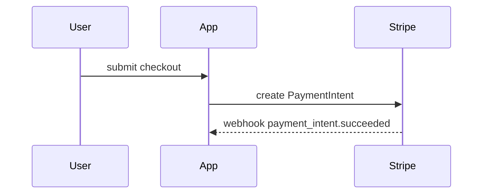

# PR

Use this template for the PR body. Skip preambles, keep prose brief, and use the project's domain language from `GLOSSARY.md` when it exists.

```markdown
## Summary

<one visual: pseudocode, call tree, file tree, diagram, or diff-sketch>

## Evidence

- **Before:** <screenshot / output / failing test run>
  **After:** <screenshot / output / passing test run>

## Merge Danger

**Door:** <one-way or two-way>

<optional: why>

**Blast radius:** <one word>

<optional: what could break on merge>
```

Lines the caller needs (`fixes #NNN`, one line per closed ticket) go after Merge Danger, unchanged.

## Summary

Pick the smallest view that makes the key point clear. Usually one; never all of them.

- Logic or an algorithm as pseudocode:

```text
on(invoice paid)
  if already reconciled
    return
  mark reconciled
  dispatch ReceiptMailer
```

- Runtime control flow as a call tree:

```text
CheckoutController@store
  PlaceOrder::handle
    ReserveStock
    ChargeCard
  OrderPlaced event
    SendConfirmation (queued)
```

- File responsibility or a broad refactor as a shallow file tree:

```text
app/
├── Actions/Billing/     # one class per billing operation
├── Models/Invoice.php   # owns invoice state
└── Jobs/SyncStripe.php  # pushes changes to Stripe
```

- Interaction or data flow as Mermaid:



- A `diff` sketch when the point is what changes inside a shape that already exists. Match the shape to the topic (call tree, file tree, state flow):

```diff
 PlaceOrder::handle
   ReserveStock
+  ApplyCoupon
   ChargeCard
-  SendConfirmation
+  OrderPlaced event
+    SendConfirmation (queued)
```

- The whole block of code only when most of it is new, or when leaving context out would hide ownership or order.

Place each visual next to the short text it supports. Keep only the calls, files, states, and boundaries the reviewer needs.

## Evidence

Concrete proof that the change works, as a before and after.

- **Screenshots** are best, when the change is visual and the environment can take them.
- **Execution output** is next: the exact test that failed and now passes (name it, and sketch its steps as pseudocode), or command output before and after.

No evidence is a finding, not a blank: say what was not verified and why.

## Merge Danger

**Door.** A two-way door is cheap to walk back: revert and redeploy. A one-way door is not: a destructive migration, a data backfill, a public API or contract change, an email sent, a queue payload shape that in-flight jobs still carry.

**Blast radius.** What the change could touch if it is wrong. Consider every consumer: other modules, queued jobs, API clients, layout, mobile, scheduled commands.
